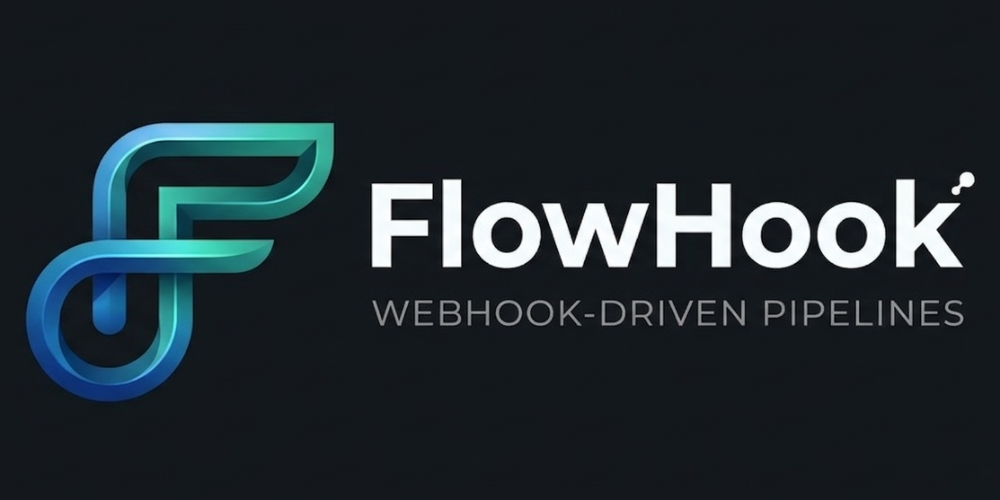

[](https://github.com/Amer-Abuyaqob/FlowHook/actions/workflows/ci.yml)
[](https://github.com/Amer-Abuyaqob/FlowHook/blob/main/.nvmrc)
[](docker-compose.yml)
[](https://codecov.io/gh/Amer-Abuyaqob/FlowHook)

# FlowHook

FlowHook is a **webhook-driven task processing pipeline**: inbound webhooks are validated and queued, a background worker runs **transform**, **filter**, or **template** actions on each job, and results are delivered to subscriber URLs with retries. Built with TypeScript and Express for the FTS X Boot.dev Backend Internship final project.

## Table of contents

- [Tech stack](#tech-stack)
- [Features](#features)
- [Installation](#installation)
- [Environment variables](#environment-variables)
- [Run locally](#run-locally)
- [Documentation](#documentation)
- [Running tests](#running-tests)
- [Scripts](#scripts)
- [Usage examples](#usage-examples)
- [Deployment](#deployment)
- [Optimizations](#optimizations)
- [Lessons](#lessons)
- [Contributing](#contributing)
- [Authors](#authors)

## Tech stack

| Layer        | Technology                             |
| ------------ | -------------------------------------- |
| Runtime      | Node.js ([`.nvmrc`](.nvmrc))           |
| Language     | TypeScript                             |
| HTTP         | Express.js                             |
| Database     | PostgreSQL                             |
| ORM / schema | Drizzle ORM, Drizzle Kit migrations    |
| Testing      | Vitest, Supertest                      |
| Tooling      | ESLint, Prettier                       |
| Ops          | Docker, Docker Compose, GitHub Actions |

## Features

- **Pipelines** — Create and manage pipelines with API key auth; each pipeline gets a unique **slug** and inbound webhook URL.
- **Three action types** — **Transform** (field mapping), **filter** (ANDed conditions), and **template** (Mustache-style `{{path}}` rendering).
- **Queued processing** — `POST /webhooks/:slug` returns **202** and enqueues work; the **worker** processes jobs asynchronously.
- **Subscribers** — Register destination URLs per pipeline; optional custom headers on outbound POSTs.
- **Delivery** — JSON POST to each subscriber with configurable retries and exponential backoff (`DELIVERY_*` env vars).
- **Job visibility** — List and inspect jobs, including **delivery attempts** and HTTP status per try.
- **Web UI** — `GET /` redirects to `/app/` for static API documentation (built assets under `dist/client` after `npm run build`).
- **Postman** — Import-ready collection and environment under [`postman/`](postman) for end-to-end checks.

## Installation

**Prerequisites:** Node.js **24** (see [`.nvmrc`](.nvmrc)), PostgreSQL **14+** (local or Docker).

```bash
git clone https://github.com/Amer-Abuyaqob/FlowHook.git
cd FlowHook
npm install
```

Create a **`.env`** file in the project root (do not commit secrets). There is no committed `.env.example`; copy variable names from [Environment variables](#environment-variables) below.

## Environment variables

Values are read in [`src/config.ts`](src/config.ts). Defaults apply when a variable is missing or invalid (except **`API_KEY`**, which is required).

| Variable                      | Required | Default / notes                                                               |
| ----------------------------- | -------- | ----------------------------------------------------------------------------- |
| `API_KEY`                     | Yes      | Authenticates protected routes (`Authorization: Bearer` or `X-API-Key`).      |
| `DATABASE_URL`                | No\*     | PostgreSQL connection string. Required for DB-backed features (CRUD, worker). |
| `BASE_URL`                    | No       | Base URL for generated webhook links; default `http://localhost:{PORT}`.      |
| `PORT`                        | No       | HTTP port; default **8080**.                                                  |
| `WORKER_POLL_INTERVAL_MS`     | No       | Worker poll interval in ms; default **1000**.                                 |
| `DELIVERY_MAX_ATTEMPTS`       | No       | Max delivery attempts per subscriber; default **3**.                          |
| `DELIVERY_BASE_DELAY_MS`      | No       | Base delay (ms) for exponential backoff; default **1000**.                    |
| `DELIVERY_REQUEST_TIMEOUT_MS` | No       | Per-attempt HTTP timeout (ms); default **5000**.                              |

\*Omitting `DATABASE_URL` limits what you can run locally; integration tests and Docker Compose expect a database.

## Run locally

### Application and worker (two processes)

1. Set `API_KEY` and `DATABASE_URL` in `.env`.
2. Apply migrations, build, and start the API:

```bash
npm run db:migrate
npm run build
npm start
```

3. In another terminal, run the worker:

```bash
npm run worker
```

The API listens on **`http://localhost:8080`** by default (or `PORT`). Health check: **`GET /api/healthz`** returns plain text **`OK`**.

**Development with hot reload:** `npm run dev` (API) and `npm run dev:worker` (worker).

### Docker Compose

Build and start API, worker, and Postgres:

```bash
docker compose build api worker
docker compose up -d
curl http://localhost:8080/api/healthz
```

The image entrypoint ([`docker-entrypoint.sh`](docker-entrypoint.sh)) runs **Drizzle migrations** before starting the process. Set `DATABASE_URL` for Compose (see [`docker-compose.yml`](docker-compose.yml)); `API_KEY` defaults to **`any-api-key`** if unset.

## Documentation

| Doc                                                  | Description                                                         |
| ---------------------------------------------------- | ------------------------------------------------------------------- |
| [docs/API.md](docs/API.md)                           | Canonical REST API (auth, errors, endpoints, action config shapes). |
| [docs/PROJECT_DESC.md](docs/PROJECT_DESC.md)         | Assignment brief and deliverables.                                  |
| [docs/DESIGN_DECISIONS.md](docs/DESIGN_DECISIONS.md) | Architecture, schema, and design choices.                           |
| [docs/DIAGRAMS.md](docs/DIAGRAMS.md)                 | Mermaid diagrams.                                                   |
| [docs/PROJECT_PLAN.md](docs/PROJECT_PLAN.md)         | Phased implementation roadmap.                                      |
| [postman/](postman)                                  | Postman collection and environment JSON files.                      |

## Running tests

```bash
npm test
```

Runs **`vitest --run`** (see [`package.json`](package.json)). Tests under `*.integration.test.ts` need **`DATABASE_URL`**, **`API_KEY`**, and applied migrations—use a local Postgres URL or mirror [`.github/workflows/ci.yml`](.github/workflows/ci.yml) (service DB + `npm run db:migrate` before tests).

Coverage:

```bash
npm run test:coverage
```

## Scripts

| Command                 | Description                                            |
| ----------------------- | ------------------------------------------------------ |
| `npm run build`         | Compile TypeScript and copy `src/app` → `dist/client`. |
| `npm start`             | Run the API (`node dist/index.js`).                    |
| `npm run worker`        | Run the background worker (`node dist/worker.js`).     |
| `npm run dev`           | API with hot reload (`tsx watch src/index.ts`).        |
| `npm run dev:worker`    | Worker with hot reload (`tsx watch src/worker.ts`).    |
| `npm test`              | Run Vitest (`vitest --run`).                           |
| `npm run test:coverage` | Vitest with coverage.                                  |
| `npm run lint`          | ESLint.                                                |
| `npm run lint:fix`      | ESLint with fixes.                                     |
| `npm run format:check`  | Prettier check.                                        |
| `npm run format:write`  | Prettier write.                                        |
| `npm run db:generate`   | Generate Drizzle migrations (`drizzle-kit generate`).  |
| `npm run db:migrate`    | Apply migrations (`drizzle-kit migrate`).              |

## Usage examples

Protected routes use your **`API_KEY`** via `Authorization: Bearer <API_KEY>` or `X-API-Key: <API_KEY>`. Full request/response shapes and error messages are in **[docs/API.md](docs/API.md)**.

```bash
# Health (no auth)
curl -s http://localhost:8080/api/healthz

# List pipelines (auth required)
curl -s -H "Authorization: Bearer $API_KEY" http://localhost:8080/api/pipelines

# Static API browser UI
curl -sI http://localhost:8080/app/
```

**Postman:** import `postman/FlowHook.postman_collection.json` and `postman/FlowHook.postman_environment.json`, then run flows to capture `pipelineId`, `pipelineSlug`, `subscriberId`, and `jobId`.

## Deployment

### Docker Compose (local / single host)

Use [`docker-compose.yml`](docker-compose.yml) for API, worker, and Postgres. Set `DATABASE_URL` and optionally `API_KEY`. Expose the API port (default **8080**).

### Google Cloud Platform (high level)

A typical production layout:

1. **Cloud SQL for PostgreSQL** — Managed Postgres; set `DATABASE_URL` to the instance connection string (private IP or Cloud SQL Auth proxy).
2. **Secrets** — Store `API_KEY` in **Secret Manager** (or equivalent) and inject into services as env vars.
3. **Two workloads** — Run the **API** (`node dist/index.js`) and **worker** (`node dist/worker.js`) as separate services (for example two **Cloud Run** services from the same container image with different commands, or **GKE** / **Compute Engine** with the same split).
4. **Health checks** — Point load balancer or Cloud Run health checks at **`GET /api/healthz`** (HTTP 200, body `OK`).
5. **Networking** — Ensure the worker can reach Cloud SQL and public subscriber URLs; restrict ingress to the API as needed.

See [Google Cloud Run documentation](https://cloud.google.com/run/docs) and [Cloud SQL](https://cloud.google.com/sql/docs) for up-to-date `gcloud` and console steps.

## Optimizations

- **Job claiming** — Pending jobs are claimed with **`SELECT … FOR UPDATE SKIP LOCKED`** so multiple workers can scale without double-processing the same row ([`src/db/queries/jobs.ts`](src/db/queries/jobs.ts)).
- **Delivery** — Exponential backoff using `DELIVERY_BASE_DELAY_MS` and `DELIVERY_MAX_ATTEMPTS` reduces thundering herds on failing endpoints.
- **Worker tuning** — `WORKER_POLL_INTERVAL_MS` trades CPU wakeups vs. latency for new jobs.

## Lessons

- Queuing webhooks decouples **ingress latency** from **downstream slowness**—returning **202** quickly while still guaranteeing work is processed.
- **Postgres as a queue** keeps ops simple for a small service, but **SKIP LOCKED** and clear job statuses are important for correctness under concurrency.
- **One global API key** is easy to ship (v1); designing auth and pipeline APIs so they can later scope by **project** or **key** saves refactors later.
- End-to-end **integration tests** with a real database caught issues that unit tests around pure functions missed.

## Contributing

Fork the repository, open a pull request against **`main`**, and ensure **`npm test`** (and lint/format CI checks) pass. Bug reports and suggestions are welcome.

## Authors

- **Amer Abuyaqob** — [GitHub](https://github.com/Amer-Abuyaqob)
