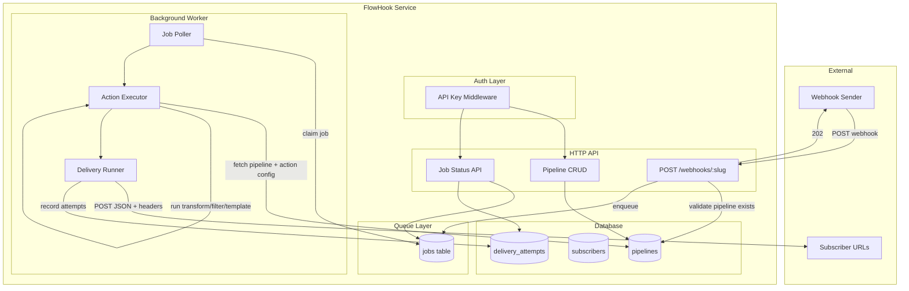

# FlowHook Project Design Plan

This plan covers architecture, data model, API design, worker flow, and infrastructure. All prior decisions are incorporated.

---

## 1. Decisions Summary

| Topic         | Choice                                                                                  |
| ------------- | --------------------------------------------------------------------------------------- |
| Actions       | JSON transform, Filter, Template render                                                 |
| Queue         | Postgres-backed (jobs table + worker polling)                                           |
| Auth          | API keys (single global for v1; design for multiple keys later)                         |
| Delivery      | POST JSON + Custom headers per subscriber (design for HMAC signing)                     |
| Inbound       | Validate first, then 202; 4xx/5xx on failure                                            |
| API key model | Single global key from env; design for per-project keys                                 |
| Webhook URL   | Slugs                                                                                   |
| Slug          | Auto-generated from pipeline name; strict format (lowercase, letters, numbers, hyphens) |

---

## 2. High-Level Architecture



---

## 3. Component Breakdown

### 3.1 HTTP API (Express)

- **Two entry points in one codebase:** `src/api/index.ts` (or `src/server.ts`) for the API, `src/worker/index.ts` for the worker. Same `package.json`, different scripts (`npm run start`, `npm run worker`).
- **Auth:** Middleware that validates `Authorization: Bearer <API_KEY>` or `X-API-Key: <API_KEY>` against `process.env.API_KEY`. Extract into `src/auth/validate.ts` with an interface like `validateAuth(req): Promise<{ valid: boolean; identity?: Identity }>` so swapping to JWT later only changes this module.
- **Unprotected routes:** `GET /api/healthz`, `POST /webhooks/:slug` (webhook ingestion does NOT require API key; the slug identifies the pipeline).
- **Protected routes (API key required):** All pipeline CRUD, all job query endpoints.

### 3.2 Webhook Ingestion

- **Route:** `POST /webhooks/:slug`
- **Flow (Q5: validate first, then 202):**
  1. Parse `slug` from path.
  2. Fetch pipeline by slug; if not found or inactive, return 404/400.
  3. Optionally validate body is valid JSON (if your actions require JSON); if not, return 400.
  4. Insert row into `jobs` table with status `pending`, pipeline_id, raw payload.
  5. Return 202 Accepted with optional `Job-Id` header.
  6. On DB/insert error, return 5xx.

### 3.3 Worker

- **Process:** Long-running Node process (separate from API).
- **Loop:** Poll `jobs` where `status = 'pending'` (with `LIMIT 1` and row locking, e.g. `SELECT ... FOR UPDATE SKIP LOCKED`), process, update status.
- **Processing steps:**
  1. Fetch pipeline (action config, subscribers).
  2. Run action (transform/filter/template) on payload.
  3. If filter drops the event, mark job as `filtered` and skip delivery.
  4. Otherwise, for each subscriber: POST JSON + custom headers, record delivery attempts with retries.
  5. Mark job `completed` or `failed`.

### 3.4 Delivery

- **Mechanism:** HTTP POST with `Content-Type: application/json`, body = processed JSON.
- **Per-subscriber headers:** Stored in `subscribers.headers` (JSONB). Sent with each POST.
- **Retry:** Configurable (e.g. 3 attempts, exponential backoff: 1s, 2s, 4s).
- **HMAC-ready:** Introduce a `DeliverySigner` interface; v1 implementation is no-op; later add HMAC signer that adds `X-FlowHook-Signature` header.

---

## 4. Database Schema

### 4.1 Tables

**pipelines**

| Column        | Type                    | Notes                                |
| ------------- | ----------------------- | ------------------------------------ |
| id            | UUID (PK)               | Default gen_random_uuid()            |
| slug          | TEXT (UNIQUE, NOT NULL) | Lowercase, letters, numbers, hyphens |
| name          | TEXT (NOT NULL)         | User-facing name (source for slug)   |
| action_type   | TEXT                    | `transform`, `filter`, `template`    |
| action_config | JSONB                   | Action-specific config (see below)   |
| is_active     | BOOLEAN                 | Default true                         |
| created_at    | TIMESTAMPTZ             |                                      |
| updated_at    | TIMESTAMPTZ             |                                      |

**subscribers**

| Column      | Type            | Notes                                             |
| ----------- | --------------- | ------------------------------------------------- |
| id          | UUID (PK)       |                                                   |
| pipeline_id | UUID (FK)       |                                                   |
| url         | TEXT (NOT NULL) | Destination URL                                   |
| headers     | JSONB           | Optional `{ "Authorization": "Bearer xxx", ... }` |
| created_at  | TIMESTAMPTZ     |                                                   |

**jobs**

| Column                | Type        | Notes                                                      |
| --------------------- | ----------- | ---------------------------------------------------------- |
| id                    | UUID (PK)   |                                                            |
| pipeline_id           | UUID (FK)   |                                                            |
| status                | TEXT        | `pending`, `processing`, `completed`, `filtered`, `failed` |
| payload               | JSONB       | Raw inbound payload                                        |
| result                | JSONB       | Processed result (null if filtered)                        |
| created_at            | TIMESTAMPTZ |                                                            |
| updated_at            | TIMESTAMPTZ |                                                            |
| processing_started_at | TIMESTAMPTZ | Null until worker claims                                   |
| processing_ended_at   | TIMESTAMPTZ | Null until done                                            |

**delivery_attempts**

| Column         | Type        | Notes                                      |
| -------------- | ----------- | ------------------------------------------ |
| id             | UUID (PK)   |                                            |
| job_id         | UUID (FK)   |                                            |
| subscriber_id  | UUID (FK)   |                                            |
| attempt_number | INT         | 1, 2, 3, ...                               |
| status_code    | INT         | HTTP response code (null if network error) |
| success        | BOOLEAN     | 2xx = true                                 |
| error_message  | TEXT        | On failure                                 |
| created_at     | TIMESTAMPTZ |                                            |

### 4.2 Action Config Shapes (JSONB)

**transform:** `{ "mappings": [ { "from": "firstName", "to": "first_name" }, { "from": "lastName", "to": "last_name", "optional": true } ] }` — rename fields; optional = don't fail if missing.

**filter:** `{ "conditions": [ { "path": "event.type", "operator": "eq", "value": "order.created" } ] }` — operators: `eq`, `neq`, `exists`, `contains`. All conditions ANDed. If no conditions match "keep", event is dropped.

**template:** `{ "template": "New order from {{customer.name}}: {{amount}}" }` — Mustache-style `{{path}}` syntax; use a small lib (e.g. mustache or custom regex) to replace `{{x.y.z}}` with value from payload.

### 4.3 Slug Generation

- Input: pipeline `name` (e.g. "My Stripe Orders").
- Output: `my-stripe-orders` — lowercase, replace spaces/special chars with `-`, collapse multiple hyphens, strip leading/trailing hyphens.
- Collision handling: if slug exists, append `-1`, `-2`, etc. until unique.
- On pipeline create: generate slug from name; validate format (regex: `^[a-z0-9]+(?:-[a-z0-9]+)*$`).

---

## 5. API Outline

### 5.1 Pipelines (all require API key)

| Method | Path                                         | Description                                                                                            |
| ------ | -------------------------------------------- | ------------------------------------------------------------------------------------------------------ |
| POST   | /api/pipelines                               | Create pipeline (name, action_type, action_config); returns full object including slug and webhook URL |
| GET    | /api/pipelines                               | List pipelines                                                                                         |
| GET    | /api/pipelines/:id                           | Get pipeline by id                                                                                     |
| PUT    | /api/pipelines/:id                           | Update pipeline                                                                                        |
| DELETE | /api/pipelines/:id                           | Delete pipeline                                                                                        |
| POST   | /api/pipelines/:id/subscribers               | Add subscriber (url, headers?)                                                                         |
| DELETE | /api/pipelines/:id/subscribers/:subscriberId | Remove subscriber                                                                                      |

### 5.2 Jobs (all require API key)

| Method | Path          | Description                                          |
| ------ | ------------- | ---------------------------------------------------- |
| GET    | /api/jobs/:id | Get job status, result, delivery attempts            |
| GET    | /api/jobs     | List jobs (query: pipelineId, status, limit, offset) |

### 5.3 Webhooks (no auth)

| Method | Path            | Description                                        |
| ------ | --------------- | -------------------------------------------------- |
| POST   | /webhooks/:slug | Ingest webhook; 202 on success, 4xx/5xx on failure |

### 5.4 Health

| Method | Path         | Description     |
| ------ | ------------ | --------------- |
| GET    | /api/healthz | Plain text `OK` |

---

## 6. Project Structure (proposed)

```
src/
├── index.ts              # API server entry (or server.ts)
├── worker.ts             # Worker entry
├── config.ts             # Env (PORT, DATABASE_URL, API_KEY)
├── db/
│   ├── schema.ts         # Drizzle schema
│   └── index.ts          # DB client
├── auth/
│   ├── validate.ts       # validateAuth(req) - API key for v1
│   └── authMiddleware.ts # Express middleware; 401 on missing/invalid key
├── routes/
│   ├── pipelines.ts
│   ├── jobs.ts
│   ├── webhooks.ts
│   └── health.ts
├── services/
│   ├── pipeline.ts       # CRUD, slug generation
│   ├── job.ts            # Enqueue, query
│   ├── worker.ts         # Poll, process, deliver
│   └── actions/
│       ├── index.ts      # Dispatcher by action_type
│       ├── transform.ts
│       ├── filter.ts
│       └── template.ts
└── lib/
    ├── delivery.ts       # POST to subscriber, retry
    └── slug.ts           # generateSlug(name), validateSlug(slug)
```

---

## 7. Docker and CI

### 7.1 Docker Compose

- **Services:** `api`, `worker`, `postgres`.
- **api:** Build from Dockerfile, run `node dist/index.js`, depends on postgres, exposes PORT.
- **worker:** Same image, different command: `node dist/worker.js`, depends on postgres. In the current phase, this is local-dev oriented; production worker rollout is phase-next.
- **postgres:** Official image, volume for data, env for user/pass/db.
- **Env:** Pass `DATABASE_URL`, `API_KEY`, `PORT` via compose env or `.env`.
- **Default runtime port:** `8080` for container and deployment consistency.

### 7.2 GitHub Actions CI

- **On push/PR:** Checkout, setup Node, `npm ci`, `npm run build`, `npm test`.
- **DB for tests:** Use `postgres` service in Actions or in-memory SQLite for unit tests if you add that path; for integration tests, spawn Postgres in CI.
- **CD deploy shape (current phase):** Deploy API service first. Use immutable image tags (`github.sha`) for traceable Cloud Run deploys, keep DB migrations in GitHub Actions, and keep platform access public while app routes remain API-key protected.

---

## 8. Design for Future Extensibility

- **Auth:** `validateAuth` returns `Identity`; v1 identity is `{ type: 'api_key' }`. Later: `{ type: 'jwt', userId, projectId }` and scope queries by project.
- **Multiple API keys:** Add `api_keys` and `projects` tables; pipelines get `project_id`; middleware resolves key to project and passes `projectId` into services.
- **HMAC signing:** `DeliverySigner` interface with `sign(payload: string): string`; v1 returns `''`; later implement HMAC and set `X-FlowHook-Signature` header.

---

## 9. Files to Create or Update (later implementation)

- **New:** `docs/DESIGN_DECISIONS.md` — save this plan + your Q1–Q5 answers.
- **Update:** [package.json](package.json) — rename to FlowHook, add `worker` script.
- **Update:** [drizzle.config.ts](drizzle.config.ts) — point to new schema.
- **Update:** [.cursorrules](.cursorrules) — project focus, FlowHook-specific rules.
- **Update:** [.env](.env) — add API_KEY, adjust DB_URL.
- **New:** `docker-compose.yml`, `Dockerfile`, `.github/workflows/ci.yml`.
