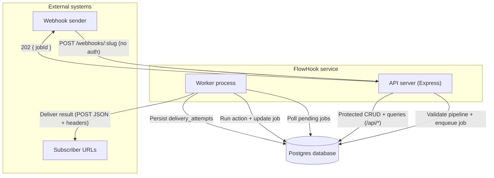
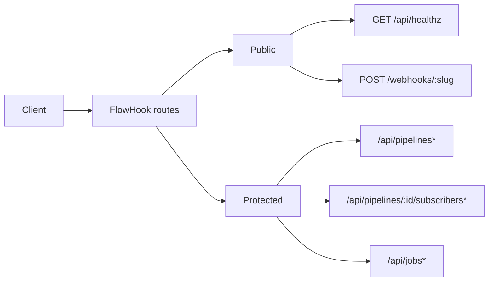
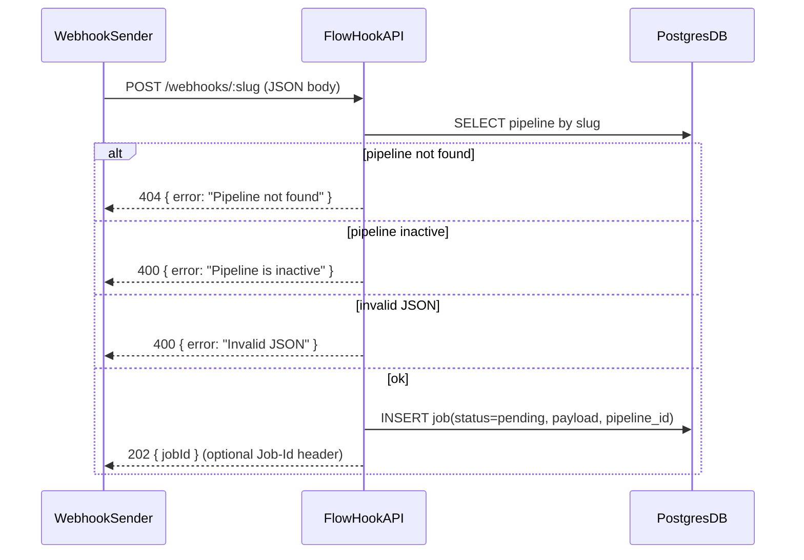
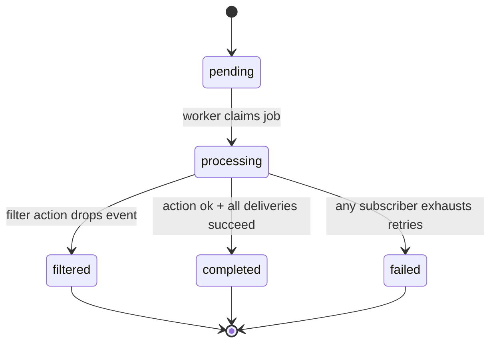
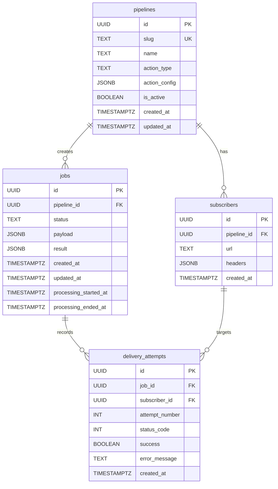
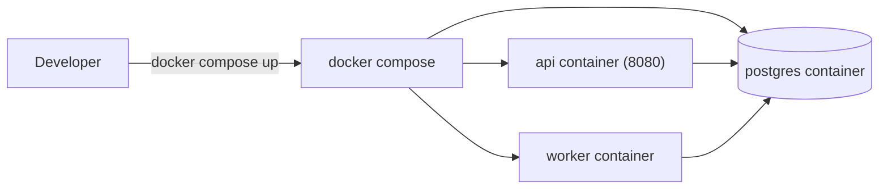

# FlowHook Diagrams (Mermaid)

These diagrams are the single source of truth for FlowHook’s architecture and runtime behavior. They are aligned to the API contract in [docs/API.md](docs/API.md).

- For the phase/branch graphs, see [docs/PROJECT_PLAN.md](docs/PROJECT_PLAN.md).

---

## A) System context (service + data flow)



---

## B) Auth matrix (public vs protected)



Auth mechanism for protected routes:

- `Authorization: Bearer <API_KEY>` or `X-API-Key: <API_KEY>`

---

## C) Webhook ingestion sequence (enqueue → 202)



---

## D) Job lifecycle (worker + delivery semantics)



Status values are exactly: `pending`, `processing`, `completed`, `filtered`, `failed`.

---

## E) Delivery & retry flow (per subscriber)

```mermaid
flowchart TD
    StartDelivery[Start delivery for job] --> ForEachSubscriber[For each subscriber]
    ForEachSubscriber --> Attempt1[Attempt 1: HTTP POST]

    Attempt1 -->|"2xx"| RecordSuccess[Record delivery_attempts(success=true)]
    Attempt1 -->|"timeout / network / non-2xx"| RecordFailure1[Record delivery_attempts(success=false)]

    RecordFailure1 --> ShouldRetry{Attempts left?}
    ShouldRetry -->|"yes"| Backoff["Wait: baseDelay * 2^(attempt-1)"]
    Backoff --> NextAttempt[Next attempt: HTTP POST]
    NextAttempt -->|"2xx"| RecordSuccess
    NextAttempt -->|"timeout / network / non-2xx"| RecordFailureN[Record delivery_attempts(success=false)]
    RecordFailureN --> ShouldRetry

    ShouldRetry -->|"no"| SubscriberFailed[Subscriber failed (exhausted retries)]

    RecordSuccess --> NextSubscriber[Next subscriber]
    SubscriberFailed --> JobFailed[Mark job failed]
    NextSubscriber --> AllDone{All subscribers done?}
    AllDone -->|"no"| ForEachSubscriber
    AllDone -->|"yes"| JobCompleted[Mark job completed]
```

Retry policy inputs (from env vars):

- `DELIVERY_MAX_ATTEMPTS`
- `DELIVERY_BASE_DELAY_MS`
- `DELIVERY_REQUEST_TIMEOUT_MS`

---

## F) ERD (data model)



---

## G) Docker / local deployment (compose mental model)


