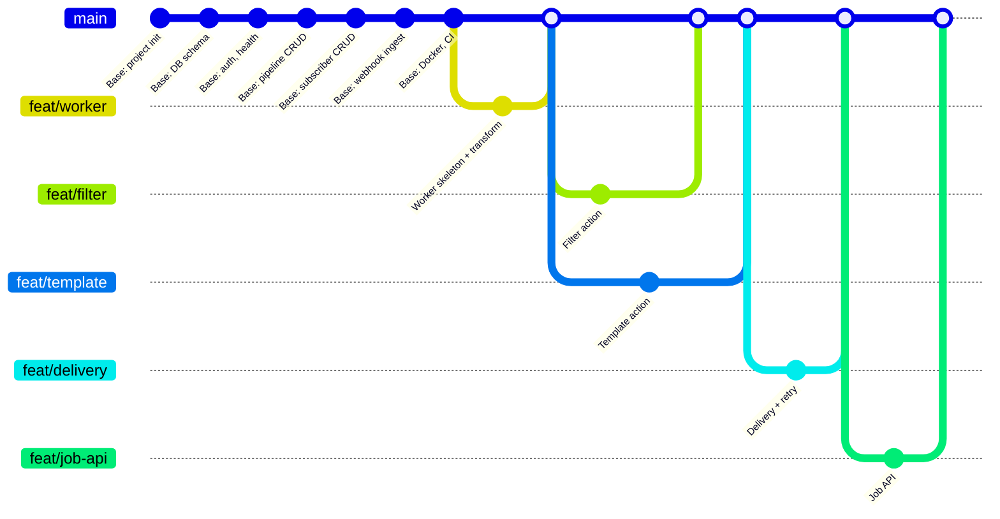
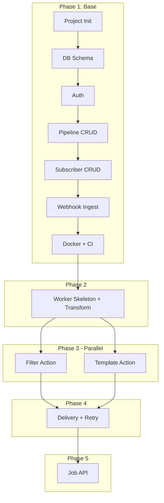

# FlowHook Implementation Plan

A phased implementation plan for FlowHook: build a solid base (DB, API, webhook ingestion, Docker) on main, then branch out for worker skeleton, three parallel action implementations, delivery, and job API. Includes a git branch graph and clear ordering for merges.

---

## PreRequirements

Complete these before creating the FlowHook project. They set up your machine and tools.

**Environment:** Ubuntu via WSL (Windows Subsystem for Linux). Commands below are for Ubuntu/WSL.

### Node.js

- **Version:** Node 24 LTS (Krypton) — Active LTS, recommended for production.
- **`.nvmrc`:** The project will include `.nvmrc` with `24`. Run `nvm use` when entering the project to switch to the correct version.
- **Install on Ubuntu/WSL:**
  - **nvm (recommended):** `curl -o- https://raw.githubusercontent.com/nvm-sh/nvm/v0.39.0/install.sh | bash` → restart terminal → `nvm install 24` → `nvm use 24`
  - **NodeSource apt:** `curl -fsSL https://deb.nodesource.com/setup_24.x | sudo -E bash -` then `sudo apt install -y nodejs`
- **Verify:** `node -v` and `npm -v`

### PostgreSQL

- **Version:** Postgres 14+ (16 recommended).
- **Install on Ubuntu/WSL:**
  - **Docker:** `docker run -d -p 5432:5432 -e POSTGRES_PASSWORD=postgres postgres:16` (easiest)
  - **Local apt:** `sudo apt update && sudo apt install -y postgresql postgresql-contrib` then `sudo service postgresql start`
- **Verify:** `psql -U postgres -c "SELECT 1"` (or `sudo -u postgres psql -c "SELECT 1"` if using local install)

### Git

- **Install on Ubuntu/WSL:** `sudo apt update && sudo apt install -y git`
- **Verify:** `git --version`

### Docker (optional but recommended)

- **Purpose:** Run full stack (`api`, `worker`, `postgres`) with `docker compose up`.
- **Install on Ubuntu/WSL:**
  - **Option A:** [Docker Desktop for Windows](https://docs.docker.com/desktop/install/windows-install/) with WSL 2 backend — Docker runs in Windows, usable from WSL
  - **Option B:** Docker Engine inside WSL — follow [Docker’s Ubuntu install guide](https://docs.docker.com/engine/install/ubuntu/)
- **Verify:** `docker --version` and `docker compose version`

### GitHub Actions Node deprecation

GitHub Actions runners are deprecating Node.js 20. Actions will default to Node.js 24 starting June 2nd, 2026. If you see a deprecation warning for `actions/checkout@v4`, `actions/setup-node@v4`, etc., add `env: FORCE_JAVASCRIPT_ACTIONS_TO_NODE24: true` to your workflow. With Node 24 for the project, this is optional.

### Project dependencies (installed later)

These are installed via `npm install` when you create the project (Phase 1). **Recommended versions for Node 24 LTS:**

| Package         | Version | Notes                                     |
| --------------- | ------- | ----------------------------------------- |
| **drizzle-orm** | ^0.45.0 | ORM; Node 24 compatible                   |
| **drizzle-kit** | ^0.31.0 | Migrations CLI                            |
| **pg**          | ^8.13.0 | PostgreSQL driver                         |
| **express**     | ^5.2.0  | Web framework; v5 requires Node 18+       |
| **vitest**      | ^4.1.0  | Test framework; peer deps support Node 24 |
| **typescript**  | ^5.7.0  | TypeScript compiler                       |
| **tsx**         | ^4.19.0 | TypeScript execution for dev              |

No need to install them globally; they live in the project's `node_modules`.

---

## Phase 1: Base (on `main`)

Build everything that does not depend on the worker. All work stays on `main` (or short-lived branches that merge quickly).

### 1.1 Core Functionalities (Implementation Order)

Implement in this order—each step builds on the previous:

| Step | What                       | Depends On                     |
| ---- | -------------------------- | ------------------------------ |
| 1    | **Project init**           | —                              |
| 2    | **DB schema + migrations** | Project init                   |
| 3    | **Config + health**        | Project init                   |
| 4    | **Auth middleware**        | Config                         |
| 5    | **Pipeline CRUD**          | DB, Auth                       |
| 6    | **Subscriber CRUD**        | Pipeline CRUD                  |
| 7    | **Webhook ingestion**      | Pipeline CRUD, DB (jobs table) |
| 8    | **Docker Compose**         | All above                      |
| 9    | **GitHub Actions CI**      | Docker, tests                  |

### 1.2 Base Deliverables

- **Project init**: `package.json`, `.nvmrc` (with `24`), TypeScript, Drizzle, folder structure per [DESIGN_DECISIONS.md](PlaningFlowHook/DESIGN_DECISIONS.md) section 6
- **DB**: All 4 tables (pipelines, subscribers, jobs, delivery_attempts) via Drizzle schema + migrations
- **API**: Pipeline CRUD, Subscriber CRUD, `GET /api/healthz`, `POST /webhooks/:slug` (validate, enqueue, 202)
- **Auth**: API key middleware for protected routes; webhook route stays unprotected
- **Docker**: `docker-compose.yml` with `api`, `worker`, `postgres` (worker is local-dev oriented until worker phase is production-ready); current Dockerfile uses `node:22-alpine`
- **CI**: `.github/workflows/ci.yml` — `npm ci`, `build`, `test`; use `node-version: '24'` or `node-version-file: '.nvmrc'`
- **Tests**: Unit + integration tests for pipeline CRUD, subscriber CRUD, webhook ingestion, auth

### 1.3 Base Complete When

- `docker compose up` runs API + Postgres on port `8080`
- Creating a pipeline, adding a subscriber, and POSTing to `/webhooks/:slug` enqueues a job with `status: pending`
- CI passes

---

## Phase 2: Worker Skeleton

**Branch**: `feat/worker` (from `main`)

**Scope**:

- Job poller loop (poll `pending`, `SELECT ... FOR UPDATE SKIP LOCKED`, claim)
- Action dispatcher: `runAction(actionType, config, payload)` → calls the right action module
- **Transform action** (real implementation)
- **Filter action** (stub: throws "not implemented")
- **Template action** (stub: throws "not implemented")
- **Delivery** (stub: no-op; job marked `completed`, result stored, no HTTP POST)

**Merge**: When jobs with `action_type: transform` can be processed end-to-end (except delivery). Worker runs, processes, stores result, marks job `completed`.

---

## Phase 3: Parallel Action Branches

**Branches** (both from `main` after `feat/worker` is merged):

| Branch          | Scope                     | File(s)                            |
| --------------- | ------------------------- | ---------------------------------- |
| `feat/filter`   | Implement filter action   | `src/services/actions/filter.ts`   |
| `feat/template` | Implement template action | `src/services/actions/template.ts` |

**Merge order**: Either can merge first. Merge both before starting `feat/delivery`.

---

## Phase 4: Delivery

**Branch**: `feat/delivery` (from `main` after `feat/filter` and `feat/template` are merged)

**Scope**:

- Replace delivery stub with real implementation
- POST JSON + custom headers to each subscriber
- Retry logic (e.g., 3 attempts, exponential backoff)
- Record `delivery_attempts` rows
- Handle filter-dropped events (no delivery, job status `filtered`)

**Merge**: When full flow works: webhook → job → action → delivery to subscribers.

---

## Phase 5: Job API

**Branch**: `feat/job-api` (from `main` after `feat/delivery` is merged)

**Scope**:

- `GET /api/jobs/:id` — job status, result, delivery attempts
- `GET /api/jobs` — list with filters (pipelineId, status, limit, offset)

**Merge**: When job query API is complete and tested.

---

## Git Branch Graph

---

## Branch Summary Table

| Branch          | Create From                      | Parallel To     | Merge When               |
| --------------- | -------------------------------- | --------------- | ------------------------ |
| `feat/worker`   | `main` (after base)              | —               | Worker + transform works |
| `feat/filter`   | `main` (after worker merge)      | `feat/template` | Filter action done       |
| `feat/template` | `main` (after worker merge)      | `feat/filter`   | Template action done     |
| `feat/delivery` | `main` (after filter + template) | —               | Delivery + retry works   |
| `feat/job-api`  | `main` (after delivery)          | —               | Job API done             |

---

## Dependency Diagram

---

## Testing Strategy (Full Coverage)

| Phase    | Unit Tests                                   | Integration Tests                                                   |
| -------- | -------------------------------------------- | ------------------------------------------------------------------- |
| Base     | Auth, slug generation, action config parsing | Pipeline CRUD, subscriber CRUD, webhook ingest (with real Postgres) |
| Worker   | Transform, filter, template actions          | Worker processes job end-to-end                                     |
| Delivery | Retry logic, backoff                         | Delivery POSTs to mock HTTP server                                  |
| Job API  | —                                            | Job list and get by ID                                              |

Use a test DB (e.g., separate Postgres in CI, or `DATABASE_URL` override for tests).

---

## Detailed TODO Tree

For a full step-by-step checklist, see [PlaningFlowHook/TODO_TREE.md](PlaningFlowHook/TODO_TREE.md).

---

## Notes for First-Time Project Planning

- **Base first**: Get a working slice (create pipeline → add subscriber → receive webhook → job enqueued) before adding the worker.
- **One merge at a time**: Merge `feat/worker` before creating `feat/filter` and `feat/template` to avoid conflicts.
- **Stubs**: Worker skeleton uses stubs for filter, template, and delivery so it compiles and runs; real implementations replace them in later branches.
- **CI from day one**: Base includes CI so every merge is validated.
